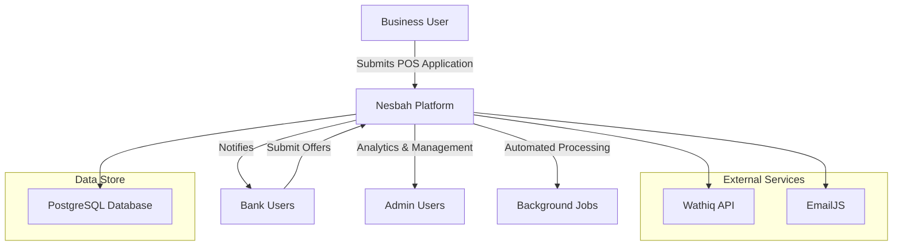

# Nesbah Platform - Comprehensive Project Documentation

**Project Name**: Nesbah (نسبة) - POS Financing Marketplace  
**Purpose**: A competitive marketplace connecting Saudi businesses seeking POS financing with banks  
**Technology Stack**: Next.js 15, React 18, PostgreSQL, Tailwind CSS, Flowbite React  
**Last Updated**: September 20, 2025

---

## Table of Contents

1. [Code Structure and Guide](#1-code-structure-and-guide)
   - 1.1 [Overview of Folder Structure](#11-overview-of-folder-structure)
   - 1.2 [Key Components and Their Purpose](#12-key-components-and-their-purpose)
   - 1.3 [How the Code is Organized](#13-how-the-code-is-organized)
   - 1.4 [Architectural Philosophy](#14-architectural-philosophy)

2. [System Architecture Overview](#2-system-architecture-overview)
   - 2.1 [Architecture Overview](#21-architecture-overview)
   - 2.2 [Component Breakdown](#22-component-breakdown)
   - 2.3 [Business Model and Revenue Flow](#23-business-model-and-revenue-flow)

3. [Database Schema](#3-database-schema)
   - 3.1 [Overview](#31-overview)
   - 3.2 [Key Tables and Relationships](#32-key-tables-and-relationships)
   - 3.3 [Design Considerations](#33-design-considerations)
   - 3.4 [Security and Compliance Notes](#34-security-and-compliance-notes)

4. [Known Bugs and Incomplete Features](#4-known-bugs-and-incomplete-features)
   - 4.1 [Known Issues](#41-known-issues)
   - 4.2 [Incomplete Features](#42-incomplete-features)
   - 4.3 [Technical Debt](#43-technical-debt)

---

## 1. Code Structure and Guide

### 1.1 Overview of Folder Structure

The project follows Next.js 15 App Router conventions with clear separation of concerns:

```
nesbah/
├── public/                          # Static assets and runtime uploads
│   ├── uploads/                     # Runtime file uploads (bank logos, documents)
│   ├── characters/                  # Marketing images (POS devices, credit cards)
│   ├── company/                     # Company branding assets
│   └── logo/                        # Nesbah branding and logos
├── src/
│   ├── app/                         # Next.js App Router (routes and pages)
│   │   ├── admin/                   # Admin portal for platform management
│   │   │   ├── analytics/           # Business intelligence dashboards
│   │   │   ├── applications/        # Application management
│   │   │   ├── bank-offers/         # Offer management
│   │   │   ├── users/               # User management
│   │   │   └── login/               # Admin authentication
│   │   ├── bankPortal/              # Bank user interface
│   │   │   ├── bankLeads/           # Lead browsing (legacy route)
│   │   │   ├── leads/               # Lead management and offer submission
│   │   │   └── bankHistory/         # Purchase history
│   │   ├── portal/                  # Business user interface
│   │   ├── api/                     # Backend API endpoints
│   │   │   ├── admin/               # Admin management endpoints
│   │   │   ├── bank/                # Bank-specific operations
│   │   │   ├── leads/               # Lead management API
│   │   │   ├── offers/              # Offer management API
│   │   │   ├── users/               # User management API
│   │   │   ├── auth/                # Authentication endpoints
│   │   │   ├── health/              # System health monitoring
│   │   │   └── upload/              # File upload handlers
│   │   ├── register/                # User registration flows
│   │   └── login/                   # Unified login system
│   ├── components/                  # Reusable UI components
│   │   ├── admin/                   # Admin-specific components
│   │   ├── auth/                    # Authentication components
│   │   ├── bank/                    # Bank portal components
│   │   └── [various UI components]
│   ├── lib/                         # Core business logic and utilities
│   │   ├── analytics/               # Analytics service and metrics
│   │   ├── auth/                    # Authentication utilities
│   │   ├── config/                  # Configuration management
│   │   ├── email/                   # Email notification services
│   │   ├── logging/                 # Structured logging utilities
│   │   ├── db.js / db.cjs           # Database connection management
│   │   ├── auction-*.js             # Auction lifecycle management
│   │   ├── background-*.js          # Background job processing
│   │   ├── application-status.js    # Application status calculations
│   │   ├── wathiq-api-service.js    # Business registration validation
│   │   └── cascade-deletion.js      # Data cleanup utilities
│   ├── contexts/                    # React contexts
│   │   ├── AdminAuthContext.jsx     # Admin authentication state
│   │   └── LanguageContext.jsx      # Internationalization
│   ├── hooks/                       # Custom React hooks
│   ├── styles/                      # Global CSS and Tailwind config
│   ├── translations/                # Arabic/English translations
│   └── __tests__/                   # Test suites
├── scripts/                         # Database migration and utility scripts
├── Dockerfile                       # Container definition for cloud deployment
├── package.json                     # Dependencies and scripts
├── tailwind.config.js               # Tailwind CSS configuration
├── next.config.mjs                  # Next.js configuration
└── TECHNICAL_DOCUMENTATION.md       # Existing technical documentation
```

### 1.2 Key Components and Their Purpose

#### Core Application Modules

**Authentication System**
- `src/lib/auth/` - Unified authentication for admin, bank, and business users
- `src/app/api/auth/unified-login/` - Single sign-on endpoint supporting all user types
- `src/contexts/AdminAuthContext.jsx` - Admin session management
- `src/components/auth/` - Authentication UI components

**Business Logic Layer**
- `src/lib/application-status.js` - Application lifecycle and status transitions
- `src/lib/auction-expiry-handler.js` - Automated auction closure processing
- `src/lib/background-tasks.js` - Background job coordination
- `src/lib/wathiq-api-service.js` - Saudi business registration validation

**Data Management**
- `src/lib/db.js` - Enhanced PostgreSQL connection pool with retry logic
- `src/lib/analytics/analytics-service.js` - Event tracking and business metrics
- `src/lib/cascade-deletion.js` - Safe data cleanup procedures

**User Interfaces**
- `src/app/portal/` - Business user dashboard for application submission
- `src/app/bankPortal/` - Bank interface for lead evaluation and offer submission
- `src/app/admin/` - Platform administration and analytics
- `src/components/admin/` - Comprehensive admin UI component library

#### External Integrations

**Wathiq API Integration**
- Purpose: Validates Saudi Commercial Registration (CR) numbers
- Implementation: `src/lib/wathiq-api-service.js`
- Used during business user registration to ensure legitimacy

**EmailJS Integration**
- Purpose: Automated email notifications to banks when new applications arrive
- Configuration: Environment variables for service, template, and API keys
- Implementation: `src/lib/email/emailNotifications.js`

### 1.3 How the Code is Organized

#### Architectural Layers

1. **Presentation Layer** (`src/app/`, `src/components/`)
   - Next.js App Router pages
   - Reusable React components
   - Responsive UI with Tailwind CSS

2. **Business Logic Layer** (`src/lib/`)
   - Application state management
   - Auction lifecycle automation
   - External API integrations

3. **Data Access Layer** (`src/app/api/`)
   - RESTful API endpoints
   - Database operations
   - Authentication middleware

4. **Infrastructure Layer**
   - Docker containerization
   - PostgreSQL database
   - Cloud deployment configuration

#### Request Flow Examples

**Business Application Submission**
1. UI: `src/app/portal/page.jsx` → Business fills POS application form
2. API: `POST /api/posApplication` → Validates and stores application
3. Business Logic: Creates auction with configurable duration
4. Integration: Sends email notifications to registered banks
5. Database: Updates `pos_application` with status 'live_auction'

**Bank Offer Submission**
1. UI: `src/app/bankPortal/leads/[id]/page.jsx` → Bank views application details
2. API: `POST /api/bank/submit-offer` → Validates bank credentials and offer data
3. Business Logic: Updates application counters and purchase tracking
4. Database: Inserts into `application_offers` and updates `pos_application.purchased_by`

### 1.4 Architectural Philosophy

**Microservice-Ready Design**
- Clear separation between business domains (auth, applications, offers, analytics)
- API-first architecture enables future service decomposition
- Database connection pooling supports horizontal scaling

**Event-Driven Processing**
- Background jobs handle auction lifecycle automatically
- Analytics events captured without blocking user operations
- Status transitions logged for audit compliance

**Security-First Approach**
- Role-based access control across all user types
- JWT-based authentication with secure cookie handling
- Input validation and SQL injection prevention

**Internationalization Support**
- Arabic and English language support
- RTL layout compatibility
- Cultural considerations for Saudi business practices

---

## 2. System Architecture Overview

### 2.1 Architecture Overview

Nesbah operates as a three-sided marketplace connecting Saudi businesses seeking POS financing with competing banks. The platform facilitates a competitive bidding process where banks submit offers for financing applications.

#### High-Level System Flow



### 2.2 Component Breakdown

#### User Roles and Portals

**Business Users**
- **Purpose**: Saudi companies seeking POS device financing
- **Portal**: `/portal` - Application submission and status tracking
- **Key Features**:
  - CR number validation via Wathiq API
  - POS financing application form
  - Document upload capability
  - Application status monitoring

**Bank Users**
- **Purpose**: Financial institutions evaluating and bidding on applications
- **Portal**: `/bankPortal` - Lead evaluation and offer submission
- **Key Features**:
  - Lead browsing with business intelligence data
  - Detailed application viewing
  - Competitive offer submission
  - Purchase history and analytics

**Bank Employees**
- **Purpose**: Bank staff members working under bank user accounts
- **Access**: Inherits permissions from parent bank user
- **Functionality**: Full bank portal access with employee tracking

**Admin Users**
- **Purpose**: Platform operators managing the marketplace
- **Portal**: `/admin` - Comprehensive platform management
- **Key Features**:
  - User management across all types
  - Application lifecycle oversight
  - Revenue analytics and reporting
  - System health monitoring

#### Core System Components

**Auction System**
- **Duration**: Configurable (default 48 hours from submission)
- **Process**: Applications automatically transition from 'live_auction' to final status
- **Automation**: Background jobs handle expiry without manual intervention
- **Revenue Model**: Banks pay to access ("purchase") leads

**Application Lifecycle**
1. **Submission**: Business submits POS financing application
2. **Live Auction**: Banks can view and submit offers (48-hour window)
3. **Completion**: Multiple banks can purchase the same lead
4. **Analytics**: Platform tracks conversion rates and revenue

**Offer Management**
- Banks submit detailed financing offers including:
  - Approved financing amount
  - Interest rates and repayment terms
  - Setup fees and transaction costs
  - Supporting documentation

### 2.3 Business Model and Revenue Flow

#### Revenue Generation

**Lead Purchase Model**
- Banks pay to access detailed business applications
- Multiple banks can purchase the same lead (non-exclusive)
- Revenue tracked in `pos_application.revenue_collected`
- Commission structure configurable per offer

**Value Proposition**

*For Businesses:*
- Access to multiple competing bank offers
- Streamlined application process with CR validation
- Transparent comparison of financing terms

*For Banks:*
- Pre-qualified leads with verified business registration
- Detailed business intelligence data
- Competitive marketplace for customer acquisition

*For Platform:*
- Transaction-based revenue from lead purchases
- Scalable marketplace model
- Data-driven insights for optimization

---

## 3. Database Schema

### 3.1 Overview

The platform uses PostgreSQL with a schema designed to support the three-sided marketplace model. The database handles user management, application processing, offer management, and analytics tracking.

### 3.2 Key Tables and Relationships

#### User Management Tables

**`users`** - Central user authentication table
- **Primary Key**: `user_id` (integer, auto-increment)
- **Key Fields**:
  - `email` (varchar, NOT NULL) - Login identifier
  - `password` (text, NOT NULL) - Bcrypt hashed password
  - `user_type` (varchar, NOT NULL) - Discriminator: 'business_user', 'bank_user', 'bank_employee', 'admin_user'
  - `entity_name` (varchar) - Company/bank name
  - `account_status` (varchar, default 'active') - Account state management
  - `verification_status` (varchar, default 'pending') - Email/identity verification
  - `created_at`, `updated_at` (timestamp) - Audit timestamps

**`business_users`** - Saudi business profiles
- **Primary Key**: `cr_national_number` (text) - Commercial Registration National Number
- **Foreign Key**: `user_id` → `users.user_id`
- **Wathiq Integration Fields**:
  - `trade_name` (varchar, NOT NULL) - Business name from CR
  - `cr_number` (text) - Commercial Registration number
  - `legal_form` (text) - Legal entity type
  - `registration_status` (varchar, NOT NULL) - Active/inactive status
  - `sector` (varchar, NOT NULL) - Business sector classification
  - `activities` (ARRAY) - Permitted business activities
  - `cr_capital`, `cash_capital` (numeric) - Capital information
  - `management_structure` (text), `management_managers` (jsonb) - Governance data
- **Additional Fields**:
  - `is_verified` (boolean, default false) - Platform verification status
  - `admin_notes` (text) - Internal notes for compliance

**`bank_users`** - Financial institution profiles
- **Primary Key**: `user_id` (references `users.user_id`)
- **Key Fields**:
  - `credit_limit` (numeric, default 1000.00) - Platform spending limit
  - `contact_person`, `contact_person_number` (varchar) - Primary contact
  - `logo_url` (varchar) - Uploaded bank logo path

**`bank_employees`** - Bank staff members
- **Primary Key**: `employee_id` (integer, auto-increment)
- **Foreign Keys**: 
  - `bank_user_id` → `bank_users.user_id` (parent bank)
  - `user_id` → `users.user_id` (employee's login)
- **Access Control**: Inherits bank user permissions

**`admin_users`** - Platform administrators
- **Primary Key**: `admin_id` (integer, auto-increment)
- **Key Fields**:
  - `email`, `password_hash`, `full_name` (varchar, NOT NULL)
  - `role` (varchar, default 'admin') - Admin role classification
  - `permissions` (jsonb, default '{}') - Granular permissions
  - `mfa_enabled`, `mfa_secret` (boolean/varchar) - Multi-factor authentication

#### Application Management Tables

**`pos_application`** - Core application data (single source of truth)
- **Primary Key**: `application_id` (integer, auto-increment)
- **Foreign Key**: `user_id` → `users.user_id`
- **Application Data**:
  - `status` (varchar, default 'submitted') - Legacy status field
  - `current_application_status` (varchar, default 'live_auction') - Current status
  - `submitted_at` (timestamp, default CURRENT_TIMESTAMP)
  - `auction_end_time` (timestamp) - Calculated auction expiry
  - Business information snapshot from Wathiq
  - POS-specific fields: `pos_provider_name`, `pos_age_duration_months`, `avg_monthly_pos_sales`
  - Financing requirements: `requested_financing_amount`, `preferred_repayment_period_months`
- **Tracking Arrays**:
  - `opened_by` (integer[]) - Banks that viewed the application
  - `purchased_by` (integer[]) - Banks that purchased lead access
  - `offers_count` (integer, default 0) - Number of offers received
  - `revenue_collected` (numeric, default 0) - Platform revenue from this application

#### Offer and Transaction Tables

**`application_offers`** - Bank financing offers
- **Primary Key**: `offer_id` (integer, auto-increment)
- **Foreign Keys**:
  - `submitted_application_id` → `pos_application.application_id`
  - `bank_user_id` → `bank_users.user_id`
  - `submitted_by_user_id` → `users.user_id`
- **Offer Terms**:
  - `approved_financing_amount` (numeric) - Approved loan amount
  - `proposed_repayment_period_months` (integer) - Loan term
  - `interest_rate` (numeric) - Annual interest rate
  - `monthly_installment_amount` (numeric) - Monthly payment
  - `grace_period_months` (integer) - Payment grace period
- **POS-Specific Terms**:
  - `offer_device_setup_fee` (numeric, default 0)
  - `offer_transaction_fee_mada`, `offer_transaction_fee_visa_mc` (numeric, default 0)
  - `offer_settlement_time_mada`, `offer_settlement_time_visa_mc` (integer, default 0)
- **Business Terms**:
  - `deal_value`, `commission_rate`, `commission_amount`, `bank_revenue` (numeric)
  - `processing_fee`, `early_payment_discount`, `late_payment_penalty` (numeric)
- **Status and Documentation**:
  - `status` (varchar, default 'submitted')
  - `offer_document`, `offer_document_mimetype`, `offer_document_filename` (bytea/varchar)
  - `accepted_at` (timestamp) - When business accepts offer

**`bank_offer_submissions`** - Submission tracking (prevents duplicate submissions)
- **Primary Key**: `id` (integer, auto-increment)
- **Unique Constraint**: (`application_id`, `bank_user_id`)
- **Foreign Keys**:
  - `application_id` → `pos_application.application_id`
  - `bank_user_id` → `bank_users.user_id`
  - `offer_id` → `application_offers.offer_id`
- **Metrics**: `submitted_at`, `first_viewed_at`, `time_to_submit_minutes`

#### Analytics and Audit Tables

**`bank_application_views`** - View tracking for analytics
- **Purpose**: Track when banks view applications for business intelligence
- **Foreign Keys**: `application_id`, `bank_user_id`
- **Metrics**: `viewed_at`, `auction_start_time`, `time_to_open_minutes`

**`status_audit_log`** - Status change tracking
- **Purpose**: Audit trail for application status transitions
- **Fields**: `from_status`, `to_status`, `admin_user_id`, `reason`, `timestamp`

**`bank_employee_audit_log`** - Employee action tracking
- **Purpose**: Track bank employee actions for compliance
- **Fields**: `employee_id`, `action_type`, `action_details`, `ip_address`

### 3.3 Design Considerations

#### Performance Optimizations

**Array-Based Tracking**
- `pos_application.opened_by` and `purchased_by` use PostgreSQL arrays
- Reduces joins for common queries (checking if bank has purchased)
- Enables efficient analytics on application engagement

**Denormalized Counters**
- `offers_count` and `revenue_collected` stored directly on applications
- Avoids expensive aggregation queries in high-traffic scenarios
- Updated transactionally to maintain consistency

**Connection Pool Management**
- Enhanced `lib/db.js` with retry logic and circuit breaker pattern
- Health check endpoints for monitoring database connectivity
- Graceful degradation under high load

#### Data Integrity

**Transactional Offer Submission**
```sql
BEGIN;
-- Insert offer
INSERT INTO application_offers (...) VALUES (...);
-- Update submission tracking
INSERT INTO bank_offer_submissions (...) ON CONFLICT DO NOTHING;
-- Update application counters
UPDATE pos_application SET offers_count = offers_count + 1, 
    purchased_by = array_append(purchased_by, $bank_user_id);
COMMIT;
```

**Audit Trail Maintenance**
- All critical state changes logged with admin user attribution
- Background job status transitions tracked separately
- Immutable audit records for regulatory compliance

### 3.4 Security and Compliance Notes

#### Data Protection

**Personal Data Handling**
- CR numbers and business data handled per Saudi regulations
- Business contact information encrypted at rest
- GDPR-compliant data retention policies

**Authentication Security**
- Passwords hashed using bcrypt with high cost factor
- JWT tokens with short expiration times
- Secure cookie handling with httpOnly and sameSite flags

#### Access Control

**Role-Based Permissions**
- Admin endpoints protected by role verification
- Bank users can only access their own offers and purchased leads
- Business users restricted to their own applications

**API Security**
- Request authentication middleware on all protected endpoints
- Input validation and SQL injection prevention
- Rate limiting on registration and sensitive endpoints

#### Compliance Features

**Audit Logging**
- All financial transactions logged with timestamps
- Admin actions tracked with IP addresses and user agents
- Bank employee actions separately audited

**Data Retention**
- Application data preserved for regulatory requirements
- User account deletion follows cascade deletion policies
- Backup and disaster recovery procedures documented
